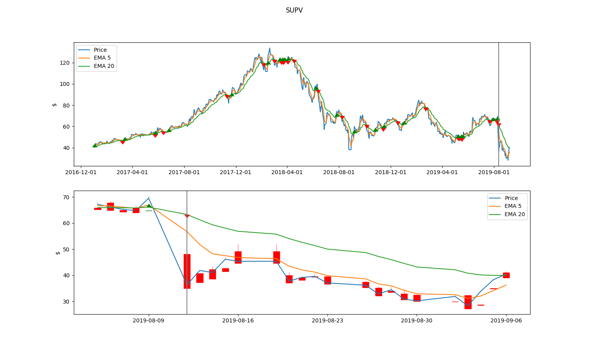

The goal of this repo is to learn a bit of [matplotlib](https://matplotlib.org), [pandas](https://pandas.pydata.org) and stocks.


Charts
------

`plot_all.py` reads stock data in .csv format and creates price plots in `charts/`. The charts are like this:




There are two subplots, one with all the data available, the other with a shorter time frame.

The green and red triangles are buy and sell signals created using a crossover of a short and medium moving average.


Fetching data
-------------

As I couldn't find any API that provides data for the stock exchange I'm interesed in (BCBA), `quotes.py` does a bit of scraping with [requests](https://github.com/psf/requests) and [BeautifulSoup](https://www.crummy.com/software/BeautifulSoup/) to get that data.

If you intend to use that script, you need to provide a yaml file like the shown below (and also make the necessary modifications on the script to adapt it to the site you'll be scraping data).

```yaml
id_re: REGEXP_TO_EXTRACT_SYMBOL_ID
se: STOCK_EXCHANGE_NAME
index:
  - - INDEX_ID
    - INDEX_SYMBOL
    - INDEX_DESC
index_url: URL_TO_FETCH_HISTORIC_INDEX_DATA
price_params:
  dates: DATE_RANGE_REQUEST_ARG
  extras:
    EXTRA_ARG_1: VALUE_1
    EXTRA_ARG_2: VALUE_2
    ...
    EXTRA_ARG_N: VALUE_N
  id: ID_REQUEST_ARG
price_url: URL_TO_FETCH_HISTORIC_DATA
symbols_url: URL_TO_FETCH_SYMBOLS_LIST
```

The data is stored in `prices/STOCK_EXCHANGE_NAME/SYMBOL.csv`
